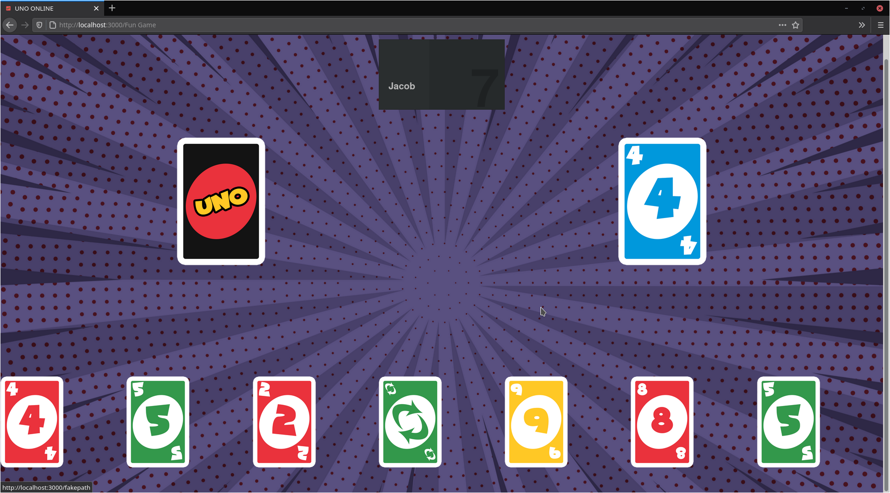
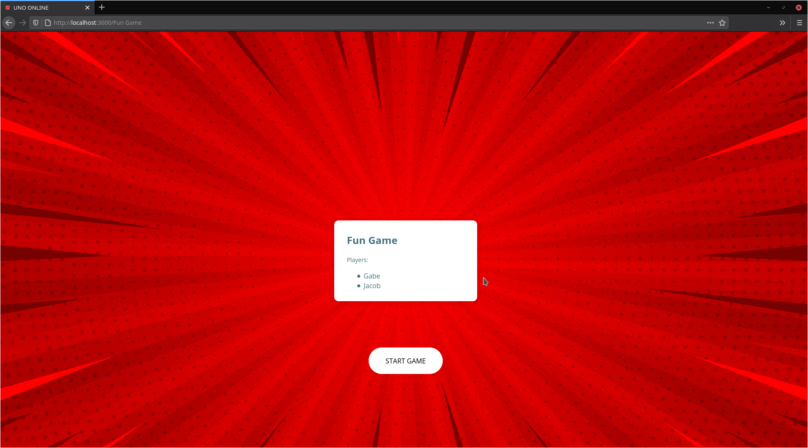
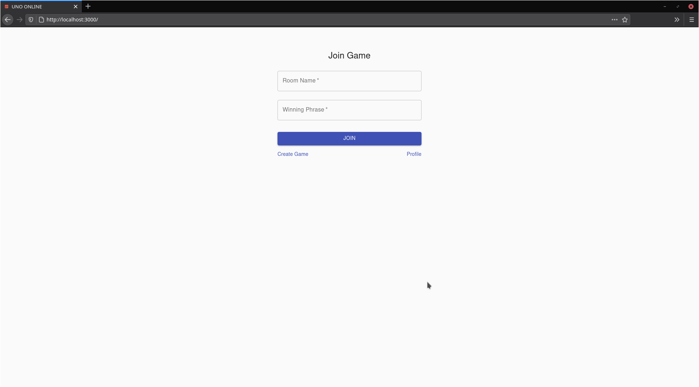
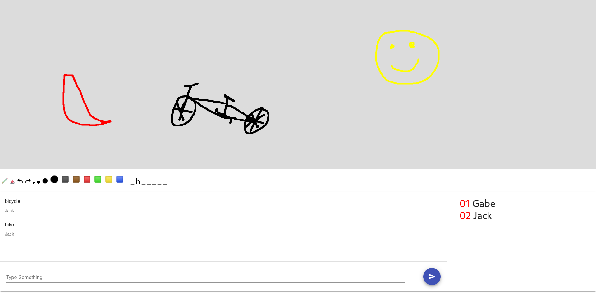

<h1 align="center">Clone Labs</h1>
<h2 align="center">A Collection of Multiplayer Mini Games</h2>

## About

Clone Labs is a collection of multiplayer mini games. The name comes from the fact that none of the games are original and are mostly rip offs of more well known games. The design is similar to Kahoot/Jackbox and was heavily inspired by Kahoot/Jackbox.

## Gameplay

Once logged in you will be able to create a room or join a room. As of right now there are only two games to choose from, but I plan on adding more games in the near future.

## Games To Be Added

- A Verse City clone. You can find the original game [here](https://www.jackboxgames.com/mad-verse-city/).
- Texas Hold 'em
- Black Jack

## Games In Progress

- A Skribbl clone. You can find the original game [here](https://skribbl.io/) (almost finished).

## Setup


```
git clone https://github.com/Gabe-Corral/Clone-Labs.git
cd Clone-Labs
pip install -r requirements.txt
npm install
npm run build
python manage.py runserver
```

You will also need to run the game server. Open a new terminal and run these commands.

```
cd Clone-Labs/server
node server.js
```

## Screenshots









## Things To Do

- Redesign winner component
- Redesign login system
- Bug fixes/improve code quality
- Add a profile page
- Clean up/improve the UI
